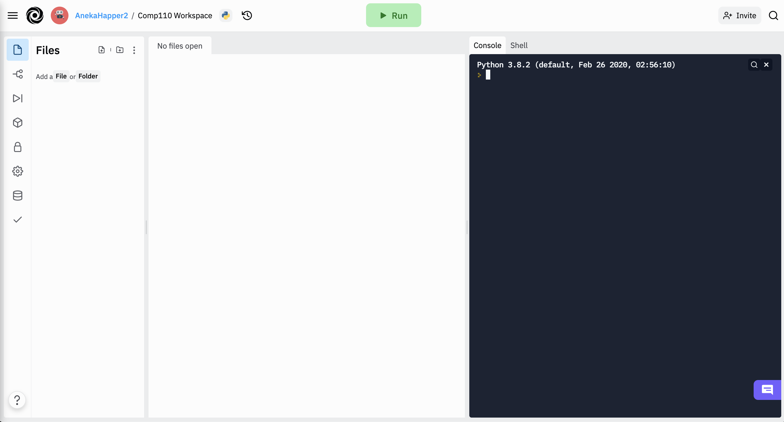

## LS00 - Welcome to COMP110! 

Hello and welcome to day 1 of COMP110, an introductory computer science course taught at the University of North Carolina at Chapel Hill. The course is designed teach the fundamentals of in the application area of data science. We focus on the Python programming language but the concepts covered are universal and can be applied to nearly all programming languages. In addition, we hope this course helps you gain practice with computational thinking and gives you a good idea of what computer science and responsible computing are all about!

Below is the introductory video lecture. Throughout the lessons, these will be linked and might start part-way through the entire video. This is because there might be extraneous infromation about the class at UNC that may not be relevant to you; however, feel free to start wherever you see fit for your learning! 

<figure class="video_container">
   <iframe width="760" height="415" src="https://www.youtube.com/embed/MaDj23J21xo?start=2015" title="YouTube video player" frameborder="0" allow="accelerometer; autoplay; clipboard-write; encrypted-media; gyroscope; picture-in-picture" allowfullscreen></iframe>
</figure>

## LS01 - Coding Environment Setup 

In order to keep things simple, we will be using a website called Replit to write all of our code. To begin, follow [this link](https://replit.com/) to make a free account. After you've signed up, you should see a "plus" (+) under the "Create" tab on the front page. Choose Python as your template and name the repl "Comp110 Workspace." It will make a new repl for you with one file called "main.py." You can go ahead and delete this (we'll be learning more about "main" and the Repl workspace later on in the course). When you're done, the enviornment should look something like this:

## EX00 - Hello, World

Throughout the course, there will be multiple opportunities to practice your coding skills and apply the concepts that are covered in lecutre. Click [here](/public/exercises/ex00_hello_world.html) to begin your very first exercise! 